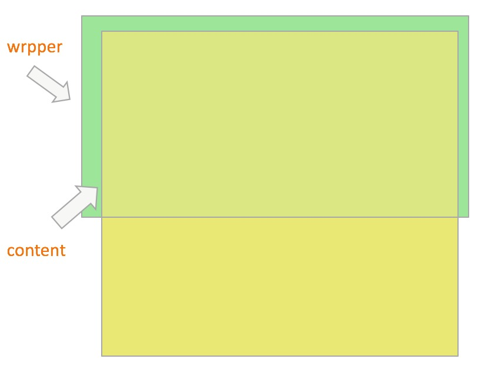

## better-scroll 使用说明

使用better-scroll可以使滑动更顺畅

#### 原理结构

</img>

#### npm

```
  npm install better-scroll --save
```

#### 使用

> html代码

```html
    <div class="wrapper">
        <ul class="content">
            <li>...</li>
            <li>...</li>
             ... 
        </ul> 
    </div>
```

> js 代码

```ecmascript 6

  import BScroll from 'better-scroll'
  
  let wrapper = document.querySelector('.wrapper') 
  let scroll = new BScroll(wrapper, {})
```

#### 遇见问题和解决方案

> 使用better-scroll导致click无效

```ecmascript 6
    解决方案
    
    let scroll = new BScroll(wrapper, {
      click: true
    })
```

